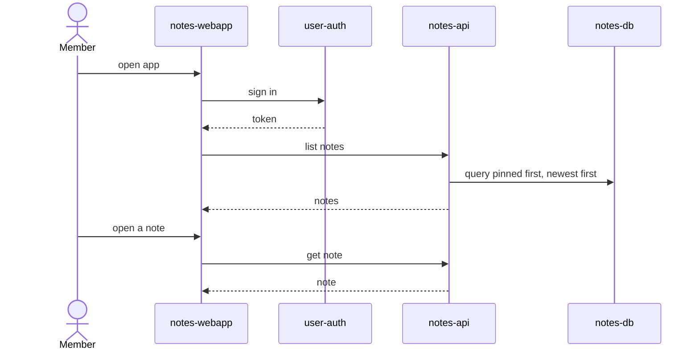

# Browse and read notes

A member signs in, sees the team's notes with pinned ones first, and opens one to read it.

```mermaid
sequenceDiagram
    actor Member
    participant notes-webapp
    participant user-auth
    participant notes-api
    participant notes-db

    Member->>notes-webapp: open app
    notes-webapp->>user-auth: sign in
    user-auth-->>notes-webapp: token
    notes-webapp->>notes-api: list notes
    notes-api->>notes-db: query pinned first, newest first
    notes-api-->>notes-webapp: notes
    Member->>notes-webapp: open a note
    notes-webapp->>notes-api: get note
    notes-api-->>notes-webapp: note
```