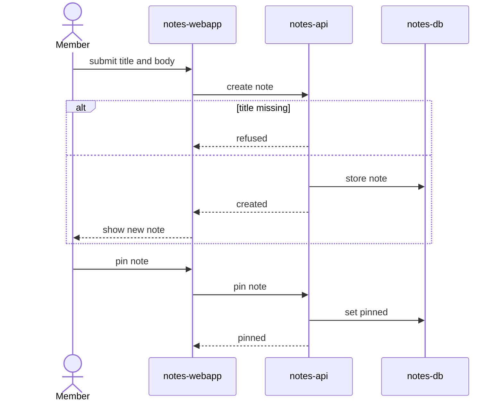

# Create and pin a note

A member creates a note and then pins it so it shows first in the team's list.

```mermaid
sequenceDiagram
    actor Member
    participant notes-webapp
    participant notes-api
    participant notes-db

    Member->>notes-webapp: submit title and body
    notes-webapp->>notes-api: create note
    alt title missing
        notes-api-->>notes-webapp: refused
    else
        notes-api->>notes-db: store note
        notes-api-->>notes-webapp: created
        notes-webapp-->>Member: show new note
    end
    Member->>notes-webapp: pin note
    notes-webapp->>notes-api: pin note
    notes-api->>notes-db: set pinned
    notes-api-->>notes-webapp: pinned
```